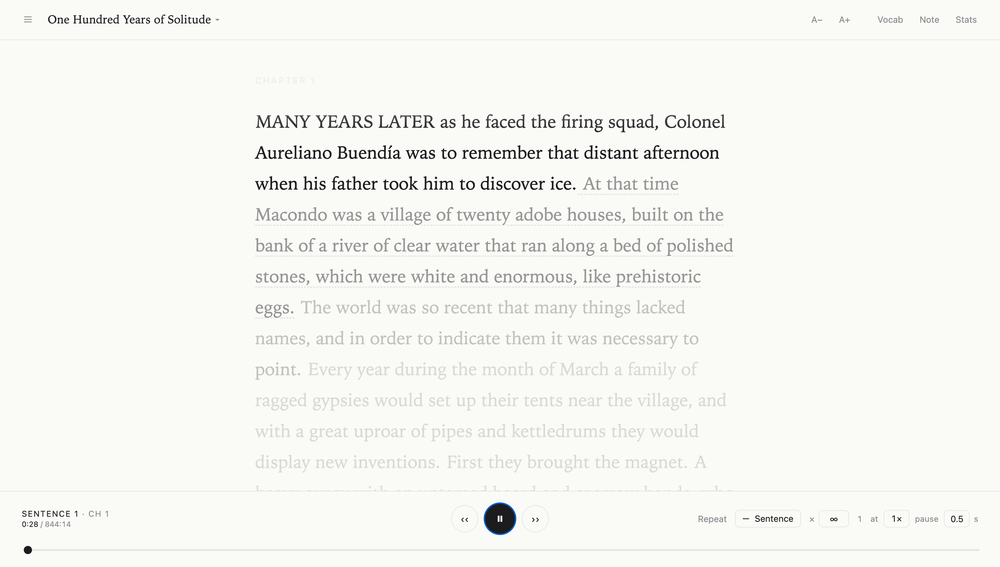
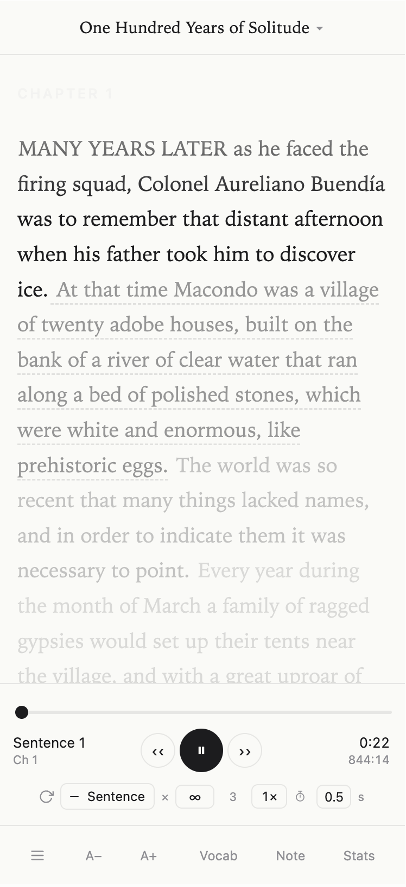

# Repeater

*Part of **The Tool I Wish Existed** — indie tools I build because nothing else was good enough.*

> A minimalist player for studying audiobooks line-by-line. Click a sentence to jump there, loop it N times, auto-advance. Word-perfect alignment so every loop is a clean cut, not an abrupt clip.

<p align="center">
  
  &nbsp;
  
</p>

## Why

Audiobook apps are built for passive listening. For learners — language students, close readers, people practicing shadowing — the basic unit of use is **"play that sentence again."** Commercial apps make this hard. Repeater makes it the primary verb.

- **Sentence-level alignment.** Every sentence has a precise start/end timestamp (±30ms), so looping is clean.
- **Any granularity.** Repeat a sentence, a paragraph, or an entire chapter.
- **Focus mode.** While audio plays, text that isn't the current unit fades. Your eye stays with your ear.
- **Vocabulary + notes.** Double-click a word for definition + Chinese translation + mnemonic. Hover a sentence to attach a note. Everything persists to local JSON.
- **Stats.** Per-chapter reading time and repeat count, so you can see what you've studied.
- **100% local, 100% free.** No accounts, no cloud, your audiobook never leaves your machine.

## Quickstart

### 1. Prerequisites

- Python 3.12+
- [uv](https://docs.astral.sh/uv/) (Python package manager)
- [ffmpeg](https://ffmpeg.org/) (audio conversion)
- [whisper.cpp](https://github.com/ggerganov/whisper.cpp) CLI (`whisper-cli` in PATH)

On macOS:
```bash
brew install uv ffmpeg whisper-cpp
```

Download a whisper model (recommend `large-v3-turbo` for best accuracy):
```bash
mkdir -p ~/models/whisper
curl -L -o ~/models/whisper/ggml-large-v3-turbo.bin \
  https://huggingface.co/ggerganov/whisper.cpp/resolve/main/ggml-large-v3-turbo.bin
```

### 2. Install

```bash
git clone https://github.com/XianLiii/tool-i-wish-existed-repeater.git
cd tool-i-wish-existed-repeater
uv sync     # installs torch, torchaudio, eng-to-ipa
```

### 3. Run

```bash
python3 scripts/range_server.py
# → http://localhost:8080
```

Open the URL in any modern browser. The library is empty on first run — follow the next section to add your first book.

## Adding a book

Two modes, both via `scripts/add_book.sh`:

### Mode A — Text + audio (highest quality)

If you have both the text (Markdown) and the audiobook (MP3):

```bash
bash scripts/add_book.sh <slug> "<Title>" <audio.mp3> <text.md> "<Author>"
```

Example:
```bash
bash scripts/add_book.sh frankenstein "Frankenstein" \
  ~/Downloads/frankenstein.mp3 \
  ~/Downloads/frankenstein.md \
  "Mary Shelley"
```

The pipeline:
1. Copy audio → `web/audio/<slug>.mp3`
2. Convert to 16kHz WAV (via ffmpeg)
3. Transcribe with whisper.cpp (for rough paragraph windows)
4. Fuzzy-match book text to Whisper tokens (first-pass alignment)
5. **wav2vec2 CTC forced alignment** (precision pass, ≤50ms per word)
6. Write `web/library/<slug>/manifest.json`

A 14-hour book takes ~30 minutes on Apple Silicon (Metal). Reload the page and the book shows up in the title dropdown.

### Mode B — Audio only (fast path)

If you only have the audio and want a quick setup:

```bash
bash scripts/add_book.sh <slug> "<Title>" <audio.mp3> - "<Author>"
```

Whisper transcribes the audio, groups sentences by pause, and emits a single-chapter manifest. No forced alignment (the transcribed text IS the text). Less accurate than Mode A but requires zero book prep.

### Testing quickly

Set `CHUNK_SECONDS=1800` to process only the first 30 minutes while iterating:
```bash
CHUNK_SECONDS=1800 bash scripts/add_book.sh demo "Demo" ./short.mp3 ./short.md
```

## Features

### Reading
- Serif prose typesetting, focus-mode gradient fade
- Adjustable font size (6 steps)
- Click any sentence → play from there
- Double-click a word → definition popup (with optional Chinese + mnemonic via Claude API)

### Playback
- Play / prev / next controls
- Repeat unit: sentence / paragraph / chapter
- Repeat count: ∞ or any positive integer
- **Configurable loop pause (0–60s)** — inserts a breathing gap between repetitions
- **Playback speed** 0.5× to 2× (0.25× increments)

### Organization
- **TOC** — jump to any chapter
- **Vocabulary** — saved words with phonetic (IPA), definitions, Chinese, mnemonic. Export to Markdown.
- **Notes** — attach a note to any sentence. Export to Markdown.
- **Stats** — per-chapter repeats + listening time, book totals.
- Multi-book library, progress tracked per book.

### Mobile
- Responsive layout: compact top title, bottom toolbar for navigation.
- All four panels (TOC, Vocab, Notes, Stats) open full-screen on small viewports.

## Architecture

```
repeater/
├── web/                     Frontend (zero-build, vanilla HTML/CSS/JS)
│   ├── index.html           UI shell
│   ├── app.js               All client logic (~1500 LOC)
│   ├── styles.css           Apple-minimalist styling + media queries
│   ├── library.json         Book list (auto-populated)
│   ├── library/<slug>/
│   │   └── manifest.json    Sentence → audio time mapping
│   ├── audio/<slug>.mp3     Audio files (gitignored)
│   └── data/                User data (vocab, notes, progress, stats)
├── scripts/                 Ingestion pipeline
│   ├── add_book.sh          Main entry — orchestrates the 6-step pipeline
│   ├── parse_text.py        Markdown → structured book JSON
│   ├── transcribe_wcpp.py   whisper.cpp wrapper with word-level timings
│   ├── transcribe_as_book.py Audio-only mode (Whisper → direct manifest)
│   ├── align.py             Fuzzy book↔Whisper alignment (SequenceMatcher)
│   ├── force_align.py       wav2vec2 CTC forced alignment (precision)
│   ├── range_server.py      HTTP server (Range requests + /api/enrich + /data/*.json)
│   └── backfill_phonetics.py Fill missing IPA in vocab.json
└── docs/
    ├── ARCHITECTURE.md      Deep dive into the technical design
    └── INGESTION.md         How the alignment pipeline handles edge cases
```

See [`docs/ARCHITECTURE.md`](docs/ARCHITECTURE.md) for the full technical walkthrough and [`docs/INGESTION.md`](docs/INGESTION.md) for the alignment pipeline's design decisions.

## Optional: Chinese + mnemonic enrichment

To get Chinese translations and memory tips on double-clicked words, set an Anthropic API key:

```bash
export ANTHROPIC_API_KEY=sk-...
# or put it in ~/.anthropic_key
```

Without a key, double-click still shows the English dictionary entry (dictionaryapi.dev).

## Where to find content

- **Audio:** [LibriVox](https://librivox.org/) — free public-domain audiobooks
- **Text:** [Project Gutenberg](https://www.gutenberg.org/) — matching public-domain texts
- For your own books: audio editions you legally own, paired with the book's markdown or ebook text.

## Contributing

PRs welcome. See [CONTRIBUTING.md](CONTRIBUTING.md).

## License

MIT. See [LICENSE](LICENSE).

## Credits

- [whisper.cpp](https://github.com/ggerganov/whisper.cpp) — fast transcription
- [torchaudio](https://pytorch.org/audio/) wav2vec2 forced alignment — precision word timing
- [dictionaryapi.dev](https://dictionaryapi.dev/) — free English dictionary
- [eng-to-ipa](https://github.com/mphilli/English-to-IPA) — offline IPA fallback
- [Anthropic Claude](https://www.anthropic.com/) — optional Chinese/mnemonic enrichment
